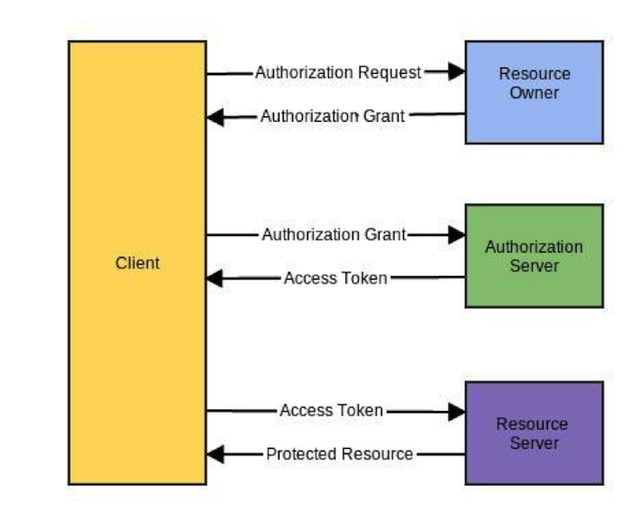
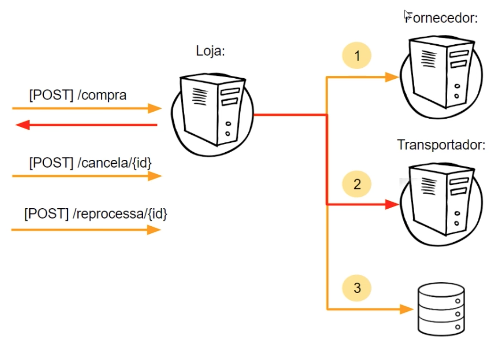
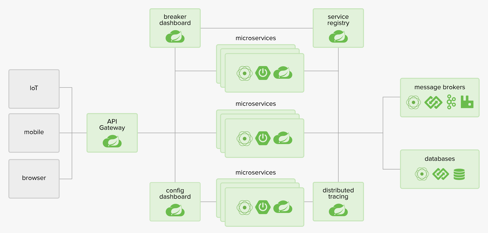

# Microservices with Spring Boot - Store :white_check_mark:

Microservices with Spring and best of all with _`MIT license`_:heart_eyes:, so that we can use these projects as a study or as a basis for new projects, even sharing new ideas:bulb:. Feel free to contribute to these projects right here.:hearts:

## Index :pushpin:
- [About the project](#about)
- [How to run](#run)
- [Projects and repositories](#prjrepo)
- [License](#license)

## About the project <a name="about"></a> :link:

O projeto foi desenvolvido utilizando Spring Boot, portanto foi adotado uma arquitetura baseada em micro serviços utilizando todo o poder do Spring Cloud e suas tecnologias. Quando estamos trabalhando com Spring temos diversas vantagens por ganharmos tecnologias e soluções já prontas para serem implementadas, portanto fizemos o uso de algumas delas.  

#### Breaking the domain into services

- Nós quebramos o domínio da solução em 3 projetos (loja, fornecedor, transportador), sendo assim em nossas APIs nós utilizamos algumas tecnologias e soluções para construir uma arquitetura sólida, segura, rastreável e escalável. Segue abaixo.:arrow_down:

#### Netflix Eureka

- Usamos o Netflix Eureka como uma solução de Service Discovery, ela é bem simples e fácil de implementar.

#### Config Server

- As configurações yaml dos projetos foram todas exportadas e configuradas através da tecnologia do Spring Cloud com o Config Server.

#### Spring Feign

- Foi utilizado Spring Feign para realizar chamadas entre micro serviços através de chamadas bem simples para seus clientes, é um projeto que foi inspirado em Retrofit, JAXRS-2.0 e WebSocket. Com ele nós também conseguimos utilizar o Client Side Load Balancer pois o Feign é integrado com o Ribbon, que por sua vez também é integrado com o Eureka.

#### Spring Cloud Sleuth

- Spring Cloud Sleuth was used to assist us with Distributed Tracing, responsible for implementing a distributed tracking solution, which helps us track requests between microservices through a correlation ID, so that we can track the entire flow of a request that goes through several microservices. To observe the logs we use Papertrail.

#### Netflix Hystrix

- Usamos o _`Netflix Hystrix`_ que implementa o padrão Circuit Breaker, que de forma bem rápida é um _`failover`_ para chamadas entre micro serviços, ou seja, caso um micro serviço estiver fora do ar um método de _`fallback`_ é chamado e aquela enxurrada de falhas é evitada.
- Nós também conseguimos usar o Bulkhead Pattern usando o 'threadPoolKey' do próprio Hystrix para isolarmos as threads e não travar nossos serviços.

#### API Gateway with Spring Zuul

- We use Spring Zuul as an API Gateway because its implementation and its high integration with Netflix Eureka are very simple. Zuul uses Eureka to know the instances of microservices and, using the Ribbon, is able to load balance user requests.

#### Spring Cloud OAuth (OAuth2) - Authentication and authorization between microservices

- Nós configuramos toda a segurança com o Spring Security e Spring Cloud OAauth e plugamos através de adapters padrões do secuirty e do OAuth2. O usuário e senha estão em memória, facilita na construção do projeto e testes.
- Em nosso JWT nós adicionamos um escopo web e mobile, e nosso cliente como loja, portanto segue a implementação padrão do JWT.
- Para cada microserviço que queremos atribuir segurança, devemos configura-lo de uma forma que ele saiba aonde ele deve se autenticar, quando chega uma requisição para o microserviço ele simplesmente bloqueia, após isso ele vai até o microserviço 'auth' para validar as informações do usuário, para dizer se pode ter acesso ao recurso ou não, se é válido ou não aquele token de acesso. Para isso devemos configurar esse fluxo, segue abaixo.:arrow_down:

```yaml
security:
  oauth2:
    resource:
      user-info-uri: http://localhost:8088/user
```

- Quando estamos utilizando um API Gateway nós precisamos repassar o token de acesso da requisição que chega ao Zuul para a requisição que o Zuul faz para os microserviços, para isso configuramos da seguinte forma:

_`application.yml`_
```yaml
zuul:
  sensitive-headers:
  - Cookie, Authorization
```

- No microserviço 'loja' quando recebemos um token de acesso para realizar um operação de compra por exemplo, nós precisamos pegar esse mesmo token e repassar para as nossas chamadas aos clientes (Feign) de outros microserviços, pois quando usamos o Feign ele irá realizar novas requisições aos clientes, porém ele não sabe as informações do header originário da requisição, por isso devemos configura-lo para ele saber qual é o header que ele deverá passar para as suas requisições aos clientes, pois os outros microserviços irão precisar se autenticar também.

- Nós implementamos um interceptor para pegarmos as informações da requisição através do 'SecurityContextHolder', fazendo uma validação se existe ou não informações de autenticação, caso exista nós conseguimos resgatar o valor do token de acesso. Com a informação do token em mãos nós usamos o RestTemplate do Feign para adicionar no header da requisição o token do usuário.

- É de extrema importância adicionar uma configuração ao Hystrix para que ele possa compartilhar o contexto de segurança, caso esteja desativado não é possível repassar o token, pois o Hystrix cria diversos pool de threads.

_`SpringMicroserviceLojaApplication.java`_
```java
// Add config to intercept Feign requests for when we call another microservices to be passed the authentication token
@Bean
public RequestInterceptor getInterceptorDeAutenticacao() {
    return new RequestInterceptor() {
        @Override
        public void apply(RequestTemplate template) {
            Authentication authentication = SecurityContextHolder.getContext().getAuthentication();
            if(authentication == null) {
                return;
            }
            
            OAuth2AuthenticationDetails details = (OAuth2AuthenticationDetails)authentication.getDetails();
            template.header("Authorization", "Bearer" + details.getTokenValue());
        }
    };
}
```
_`application.yml`_
```yaml
hystrix:
  shareSecurityContext: true
```

Segue abaixo o fluxo do OAuth2.:arrow_down:


#### Handling errors in the integration between services

- To deal with this type of error we made a simple implementation, where each step that the microservice store requests for other services we save the request status in the entity, so that if there is Hystrix treatment we can make another request from that state. Here are the status we use: _`RECEIVED`_, _`ORDER_REQUESTED`_ and _`RESERVE_DELIVERED`_.



#### Spring Cloud with Spring Boot

Building distributed systems doesn't need to be complex and error-prone. Spring Cloud offers a simple and accessible programming model to the most common distributed system patterns, helping developers build resilient, reliable, and coordinated applications. Spring Cloud is built on top of Spring Boot, making it easy for developers to get started and become productive quickly.



## How to run <a name="run"></a> :wrench:

This project was built from a use of .....This project was built from a use of .....This project was built from a use of .....This project was built from a use of .....This project was built from a use of .....This project was built from a use of .....This project was built from a use of .....This project was built from a use of .....This project was built from a use of .....This project was built from a use of .....This project was built from a use of .....This project was built from a use of .....This project was built from a use of .....This project was built from a use of .....This project was built from a use of .....

## Projects and repositories <a name="prjrepo"></a> :file_folder:

#### Applications :computer:

- [spring-microservice-loja](https://github.com/mupezzuol/spring-microservice-loja) - Microservice related to the application of the store. _Tags: `loja`_
- [spring-microservice-fornecedor](https://github.com/mupezzuol/spring-microservice-fornecedor) - Microservice related to supplier application. _Tags: `fornecedor`_
- [spring-microservice-transportador](https://github.com/mupezzuol/spring-microservice-transportador) - Microservice related to the application of the carrier. _Tags: `transportador`_

#### Spring Cloud and Config Server :notebook_with_decorative_cover:

- [spring-microservice-config-server](https://github.com/mupezzuol/spring-microservice-config-server) - Microservice for spring cloud configuration. _Tags: `configuration`_
- [spring-microservice-config-server-repo](https://github.com/mupezzuol/spring-microservice-config-server-repo) - Microservice related to the config server repository. _Tags: `yaml`_

#### Spring Security - OAuth2 :closed_lock_with_key:

- [spring-microservice-auth](https://github.com/mupezzuol/spring-microservice-auth) - Microservice related to the application of authentication and authorization between microservices with OAuth2. _Tags: `OAuth2`, `Security`_

#### Service Registration and Discovery :mag_right:

- [spring-microservice-eureka-server](https://github.com/mupezzuol/spring-microservice-eureka-server) - Microservice related to Netflix Eureka server application. _Tags: `Eureka`_

#### API Gateway :traffic_light:

- [spring-microservice-zuul](https://github.com/mupezzuol/spring-microservice-zuul) - Microservice related to Netflix Zuul server application. _Tags: `proxy`_

#### Monitoring :chart_with_upwards_trend:

- [spring-microservice-boot-admin](https://github.com/mupezzuol/spring-microservice-boot-admin) - Microservice related to microservice monitoring with Spring Boot Admin. _Tags: `actuator`, `swagger`_

## License <a name="license"></a> :clipboard:

Feel free to contribute, we continue with an _`MIT license`_. :heart_eyes:[here](https://github.com/mupezzuol/spring-microservice-loja/blob/master/LICENSE)